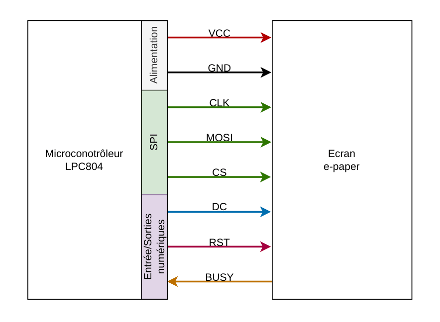
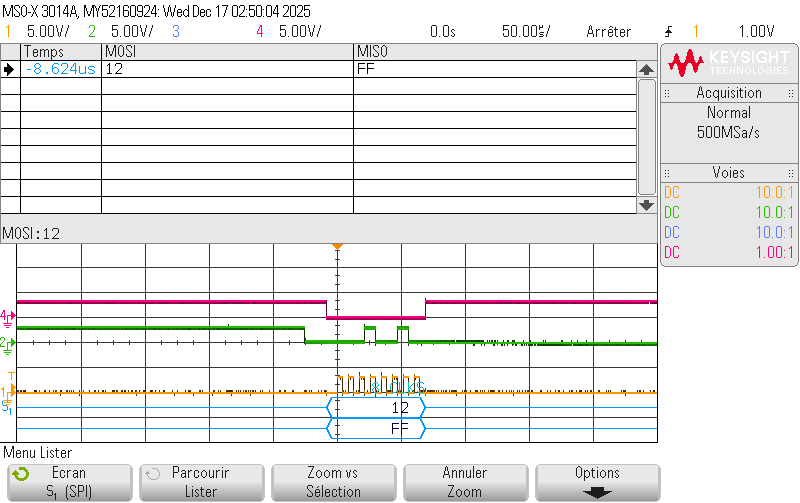
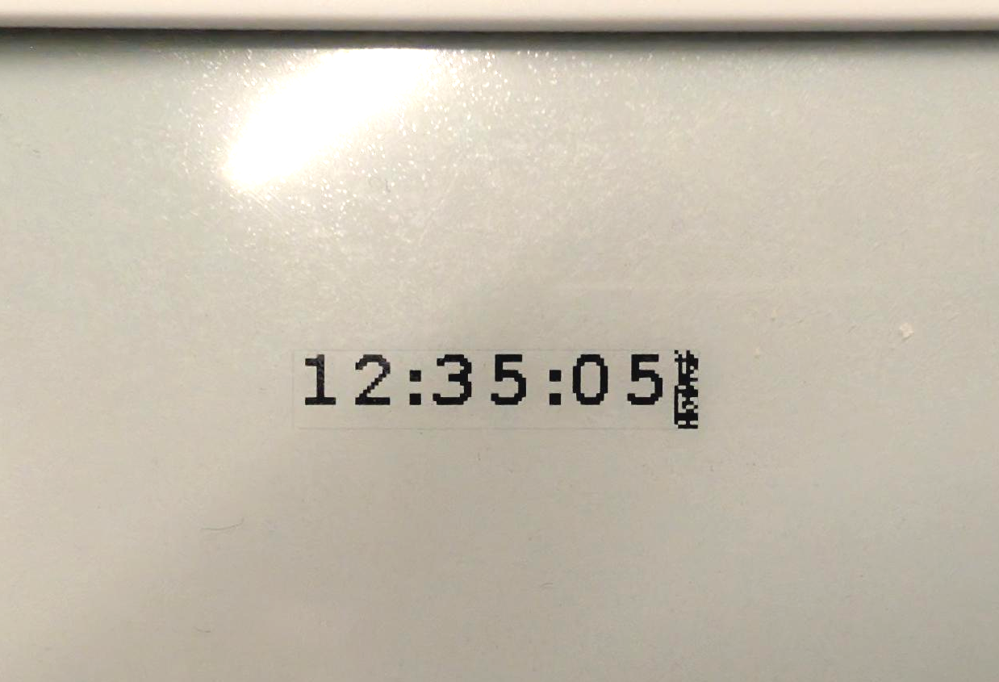

# Waveshare-ePaper-LPC804

E-paper display control with small LPC804 microcontroler for low-power clock

## Context

E-paper displays use a display technology that is quite different from most conventional screens. They consist of a liquid polymer layer containing charged pigment microcapsules, placed between two electrode layers.  
Applying an electric field between these electrode layers causes the microcapsules to move, thereby controlling the display (see figure below).

Like a sheet of paper, e-paper displays rely on reflected ambient light and do not require a backlight. As a result, they only consume energy when their state changes. Their refresh rate, however, is much lower than that of a conventional display.

These characteristics make them well suited for implementing a low-power clock updated once per minute when combined with a small microcontroller.

*Physical operating principle of an e-paper display*

## Objective

The objective of this project is to control a **7.5-inch (800×480) e-paper display** using an **LPC804** microcontroller and to display the current time on it.

## Communication with the display

Communication between the **LPC804** and the display is achieved using the **SPI** protocol along with several additional control pins, via the display’s driver circuit.

### Pin functions

| Pin  | Function |
|-----|----------|
| VCC | 5 V power supply |
| GND | Ground |
| CLK | SPI clock |
| MOSI | SPI Master Out / Slave In |
| CS  | SPI chip select |
| DC  | Data / command mode selection |
| RST | Display reset |
| BUSY | Display busy / ready status |

## Available libraries

The display manufacturer, **Waveshare**, provides a set of libraries for various platforms such as **Raspberry Pi** and **Arduino**.  
Since no library exists for the **LPC804**, the chosen approach was to port the **C library written for STM32** microcontrollers.

The first step of the project therefore consisted in adapting the STM32-specific functions so that they work with the **LPC804**, including:

- SPI communication
- GPIO read/write functions
- blocking delay functions

Although this porting process requires a non-negligible amount of time, it avoids having to create a library from scratch, which would have required manually implementing the control sequences described in the display’s *datasheet*.  
During the porting process, functions that were not required for the selected display were removed.

## Difficulties encountered

Several difficulties were encountered during the realization of this project:

- **Understanding the existing library** and determining how to replace STM32-specific functions with LPC804-compatible ones.
- **Hard-to-diagnose compilation errors**: a function used to display Chinese characters was responsible for a compilation error, but the compiler did not explicitly identify it.
- **Hardfault errors**:  
  The library used `malloc` to allocate approximately **42 kilobytes** of heap memory to store the entire display buffer (800×480 pixels), while the **LPC804 only provides 4 kilobytes of RAM** in total.  
  This required modifying the library to allow updating the display **in smaller regions** rather than all at once.
- **Display not working despite correct SPI signals**:  
  Even though the SPI commands were verified as correct using an oscilloscope, the display did not respond as expected.  
  It turned out that a **20 ms delay must be inserted before and after each byte sent in command mode** (this delay is not required in data mode).

## Conclusion

It is now possible to control the e-paper display using the **LPC804** microcontroller and to display a user-defined time, which is then incremented over time.

Possible extensions of this project include:
- Adding an easy way to set or retrieve the current time
- Modifying the size and style of the font used to display the time
- Adding a battery to turn the system into a fully autonomous clock

## References

- Waveshare – *800×480, 7.5inch E-Ink display HAT*  
  https://www.waveshare.com/product/displays/e-paper/7.5inch-e-paper-hat.htm

- Waveshare – *7.5inch e-Paper HAT Manual*  
  https://www.waveshare.com/wiki/7.5inch_e-Paper_HAT_Manual

- Wikipedia – *Electronic paper*  
  https://en.wikipedia.org/wiki/Electronic_paper

- Waveshare – *e-Paper STM32 Library*  
  https://github.com/waveshareteam/e-Paper/tree/master/STM32

- Waveshare – *e-Paper Driver HAT schematic*  
  https://files.waveshare.com/upload/8/87/E-Paper-Driver-HAT-Schematic.pdf

- Waveshare – *7.5inch e-Paper V2 datasheet*  
  https://files.waveshare.com/upload/6/60/7.5inch_e-Paper_V2_Specification.pdf
